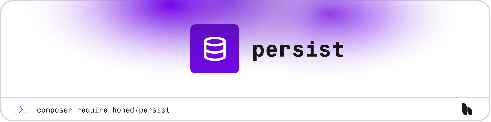

<a href="https://honed.dev/persist">
    <picture>
        <source media="(prefers-color-scheme: dark)" srcset="art/header-dark.png">
        
    </picture>
</a>

# Persist

<p>
    <a href="https://github.com/honedlabs/persist/actions"></a>
    <a href="https://packagist.org/packages/honed/persist"></a>
    <a href="https://packagist.org/packages/honed/persist"></a>
</p>

**Persist** Create stores for persisting common data to a single key..

## Installation

> **Requires [PHP 8.2+](https://php.net/releases/)**

> **Requires [Laravel 11+](https://laravel.com/docs/releases).**

Get started with the package by requiring it in your PHP project using [Composer](https://getcomposer.org/).

```bash
composer require honed/persist
```

## Documentation

Please refer to the [documentation](https://honed.dev/persist) for the usage of the package.

## License

**Persist** was created by [Joshua Wallace](https://joshua-wallace.com) under the [MIT license](https://opensource.org/licenses/MIT).